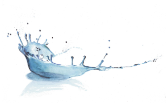
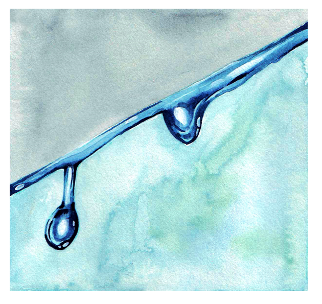
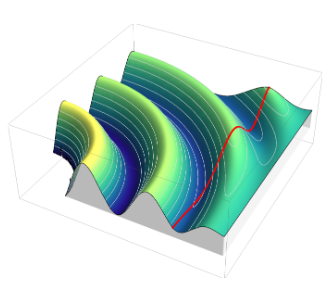
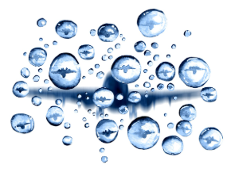

# Radu Cimpeanu Scientific Computing Group

### 💧 Applied Mathematics · Multi-scale · Multi-physics · Computational Fluid Dynamics

---

## 🔬 About the Group

We are a computational applied mathematics research group based at the **[Warwick Mathematics Institute](https://warwick.ac.uk/fac/sci/maths)** in the United Kingdom. We focus on *interfaces*, with our work sitting at the intersection of analytical and computational methods, combining **reduced-order modelling**, **asymptotic analysis**, **stability theory** and **direct numerical simulation**, targeting technologically relevant problems across fluid mechanics (involving, you guessed it, *interfaces* arising in physical systems involving droplet, bubble or liquid film dynamics), computational acoustics, and beyond (with quite a few industrial mathematics projects and examples of knowledge exchange). Making physical insight and results arising from complex simulation workflows readily deployable and usable in cross-disciplinary contexts is an important mission of ours.

---

## 🎓 Members

### Current doctoral students

- [Anton Oleinik](https://warwick.ac.uk/fac/sci/hetsys/people/hetsysstudents/antonoleinik/) — Interfacial flows in porous media (started 2025), co-supervised with [Ellen Luckins](https://warwick.ac.uk/fac/sci/maths/people/staff/Luckins/)
- [Stephan Gambart](https://warwick.ac.uk/fac/sci/hetsys/people/hetsysstudents/stephangambart/) — Programmable fluids & metamaterials (started 2025), co-supervised with [Bryn Davies](https://warwick.ac.uk/fac/sci/maths/people/staff/Davies/)
- [Rumesh Sudhaharan](https://warwick.ac.uk/fac/sci/hetsys/people/cohort6/rumeshsudhaharan/) — Spreading and solidifying droplets (started 2024), co-supervised with [James Sprittles](https://warwick.ac.uk/fac/sci/maths/people/staff/james_sprittles/) and [Thomas Sykes](https://warwick.ac.uk/fac/sci/eng/people/thomas_sykes/)
- [Minerva Schuler](https://warwick.ac.uk/fac/sci/hetsys/people/cohort5/minervaschuler/) — Bioreactor modelling for alternative proteins (started 2023), co-supervised with [Ferran Brosa Planella](https://warwick.ac.uk/fac/sci/maths/people/staff/brosa-planella/)
- [Sebastian Dooley](https://warwick.ac.uk/fac/sci/hetsys/people/studentscohort4/dooley/) — Data-driven approaches for liquid films (started 2022), co-supervised with [James Sprittles](https://warwick.ac.uk/fac/sci/maths/people/staff/james_sprittles/) and [Albert Bartok-Partay](https://warwick.ac.uk/fac/sci/eng/people/albert_bartok-partay/)

### Alumni

- [Oscar Holroyd](https://www.linkedin.com/in/oscar-holroyd-95b8152b3) · [Google Scholar](https://scholar.google.co.uk/citations?hl=en&user=axTaYyYAAAAJ) — Control strategies for thin film flows (HetSys CDT, 2021–2025), project co-supervised with [Susana Gomes](https://warwick.ac.uk/fac/sci/maths/people/staff/gomes/)
- [Benjamin Fudge](https://www.linkedin.com/in/ben-fudge-b81729252/) · [Google Scholar](https://scholar.google.co.uk/citations?user=S5x8qrUAAAAJ&hl=en&inst=11838829032869305745) — Drop impact and splashing dynamics (Department of Engineering Science, University of Oxford, 2018–2023), project co-supervised with [Alfonso Castrejon-Pita](https://eng.ox.ac.uk/people/alfonso-a-castrejon-pita)
- [Michael Negus](https://www.linkedin.com/in/michael-negus) · [Google Scholar](https://scholar.google.co.uk/citations?hl=en&user=2pY9_AIAAAAJ) — High-speed impact onto deformable substrates (Mathematical Institute, University of Oxford, 2018–2022), project co-supervised with [Madeleine Moore](https://www.matheleine.com/) and [Jim Oliver](https://www.maths.ox.ac.uk/people/james.oliver)

---

## 🎯 Research Themes

<table>
  <tr>
    <td align="center"></td>
    <td align="center"></td>
    <td align="center"></td>
    <td align="center"></td>
  </tr>
  <tr>
    <td align="center" width="25%">💧 <b>Drop impact</b> Bouncing · Coalescence · Splashing · Multi-fluid systems</td>
    <td align="center" width="25%">⚡ <b>Multi-physics flow control</b> Electrohydrodynamics · Falling films · Feedback control · Bioreactors</td>
    <td align="center" width="25%">🔊 <b>Computational acoustics</b> Perfectly matched layers · Helmholtz equation · Focused ultrasound</td>
    <td align="center" width="25%">🏭 <b>Industrial mathematics</b> Aircraft anti-icing · Vacuum pumps · Pesticide sprays · Port logistics</td>
  </tr>
</table>

We are also getting to grips with a few new exciting topics as we speak:
- 🔍 data-driven equation discovery - check out [our latest pre-print](https://arxiv.org/abs/2606.13336) on the topic!
- 🧊 phase change and icing
- 🌀 multi-stable meta-fluids
- 🧩 flow through porous media
- 🦠 non-Newtonian/rheological aspects of fluids flow

---

## 🛠️ Technical Stack

**Simulation frameworks:**
- [Basilisk C](http://basilisk.fr) — adaptive mesh refinement, volume-of-fluid interface tracking, MPI parallelism
- [oomph-lib](https://github.com/oomph-lib/oomph-lib) — object-oriented FEM library for multi-physics problems, fluid–structure interaction, acoustics

**Modelling toolchains:** MATLAB (reduced-order models, asymptotic analysis), Python (post-processing, data workflows)  
**HPC:** Warwick Scientific Computing Research Technology Platform; external allocations at national facilities

---

## 🚀 Featured Repositories

| Repository | Description | Tech | DOI |
|---|---|---|---|
| 💧 [BouncingDroplets](https://github.com/rcsc-group/BouncingDroplets) | DNS of inertio-capillary drop rebound off liquid pools | Basilisk C | [JFM 2023](https://doi.org/10.1017/jfm.2023.88) |
| 💧 [BouncingDropletsMovingPool3D](https://github.com/rcsc-group/BouncingDropletsMovingPool3D) | 3D drop impact in the bouncing regime onto moving pools | Basilisk C | [JFM 2026](https://doi.org/10.1017/jfm.2026.11232) |
| 💧 [SplashingDropletsMovingPool3D](https://github.com/rcsc-group/SplashingDropletsMovingPool3D) | 3D drop impact in the splashing regime | Basilisk C | [JFM 2026](https://doi.org/10.1017/jfm.2026.11586) |
| 💧 [DropImpactViscousPool](https://github.com/rcsc-group/DropImpactViscousPool) | Impact of drops onto pools of a different liquid | Basilisk C | [JCIS 2023](https://doi.org/10.1016/j.jcis.2023.03.040) |
| ⚡ [FallingFilmControlLQR2D](https://github.com/rcsc-group/FallingFilmControlLQR2D) | LQR feedback control of 2D falling liquid films | Basilisk C | [SIAP 2024](https://doi.org/10.1137/23M1548475) |
| 🧫 [BioReactor](https://github.com/rcsc-group/BioReactor) | Rocking wave bioreactor — cultivated meat application | Basilisk C | [IJMF 2025](https://doi.org/10.1016/j.ijmultiphaseflow.2025.105375) |
| 📐 [BouncingDropletsLiquid2D](https://github.com/rcsc-group/BouncingDropletsLiquid2D) | Reduced-dimensional model for 2D drop rebound | MATLAB | [Proc. R. Soc. A 2025](https://doi.org/10.1098/rspa.2024.0956) |

---

## 📚 Recent Publications

1. **Sykes, Alventosa, Castrejon-Pita, Cimpeanu, Harris, Castrejon-Pita** — *Fast droplet impact onto slowly moving deep pools*, J. Fluid Mech. **1037**, A11 (2026). [doi:10.1017/jfm.2026.11586](https://doi.org/10.1017/jfm.2026.11586)
2. **Harris, Alventosa, Sand, Silver, Mohammadi, Sykes, Castrejon-Pita, Cimpeanu** — *Bouncing to coalescence transition for droplet impact onto moving liquid pools*, J. Fluid Mech. **1030**, A16 (2026). [doi:10.1017/jfm.2026.11232](https://doi.org/10.1017/jfm.2026.11232)
3. **Holroyd, Cimpeanu, Gomes** — *Nonlinear estimators for the observation and stabilization of falling liquid films*, Proc. R. Soc. A **481**, 2327 (2025). [doi:10.1098/rspa.2025.0539](https://doi.org/10.1098/rspa.2025.0539)
4. **Gabbard, Agüero, Cimpeanu, Kuehr, Silver, Barotta, Galeano-Rios, Harris** — *Drop rebound at low Weber number*, J. Fluid Mech. **1019**, A25 (2025). [doi:10.1017/jfm.2025.10589](https://doi.org/10.1017/jfm.2025.10589)
5. **Kim, Harris, Cimpeanu** — *Computational modeling of fluid motion in a rocking bioreactor*, Int. J. Multiphase Flow **193**, 105375 (2025). [doi:10.1016/j.ijmultiphaseflow.2025.105375](https://doi.org/10.1016/j.ijmultiphaseflow.2025.105375)

→ **[Full publication list](https://www.raducimpeanu.com/funding-and-output/publications)**

---

## 🤝 Collaborator Network

We work closely with several fantastic experimental and theoretical groups, currently having strong collaborative links with:

| Group | Institution | Shared Focus |
|---|---|---|
| [Harris Lab](https://github.com/harrislab-brown) | Brown University | Drop impact · Bouncing dynamics · Bioreactors |
| [Oxford Fluids Lab](https://github.com/OxfordFluidsLab) | University of Oxford | High-speed impact · Splashing · Coalescence |

We also work closely with colleagues at [Imperial College London](https://www.imperial.ac.uk), [University of Manchester](https://www.manchester.ac.uk), [Loughborough University](https://www.loughborough.ac.uk), [Cranfield University](https://www.cranfield.ac.uk/), [University of East Anglia](https://www.uea.ac.uk/), [University of Strathclyde](https://www.strath.ac.uk), [University of Limerick](https://www.ul.ie/), [Queensland University of Technology](https://www.qut.edu.au/), and are grateful to the many fantastic colleagues across our network who support us.

---

## 🌟 Sustainable Software Engineering Commitment

For quite a few years we have done our best to release accessible implementations (source code, tutorial, examples) alongside any publications and outputs from the group. We will strive to do so in the future as well. Have a look around and do not hesitate to get in touch with us at conferences, workshops or just by reaching out if you have interesting ideas to extend this space. A complete list of publication with companion codes can be found [here](https://github.com/rcsc-group/.github/blob/main/Publications.md).

---

## 💡 Get Involved

- 🎓 **Prospective PhD/postdoc students:** See [open opportunities](https://www.raducimpeanu.com/supervision) or reach out directly
- 🤝 **Research collaborations:** We welcome contacts from experimental, theoretical, and industrial partners
- 💻 **Code issues / questions:** Just get in touch, either by opening an issue or letting us know. We're pretty friendly!
- 📧 **Contact:** [Radu.Cimpeanu [at] warwick.ac.uk](mailto:Radu.Cimpeanu@warwick.ac.uk) · [LinkedIn](https://www.linkedin.com/in/raducimpeanu/)

